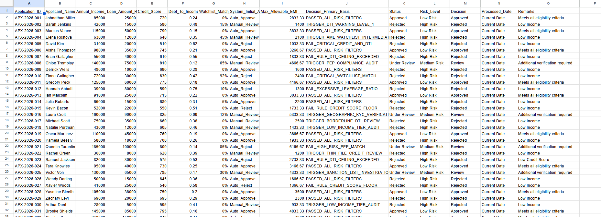
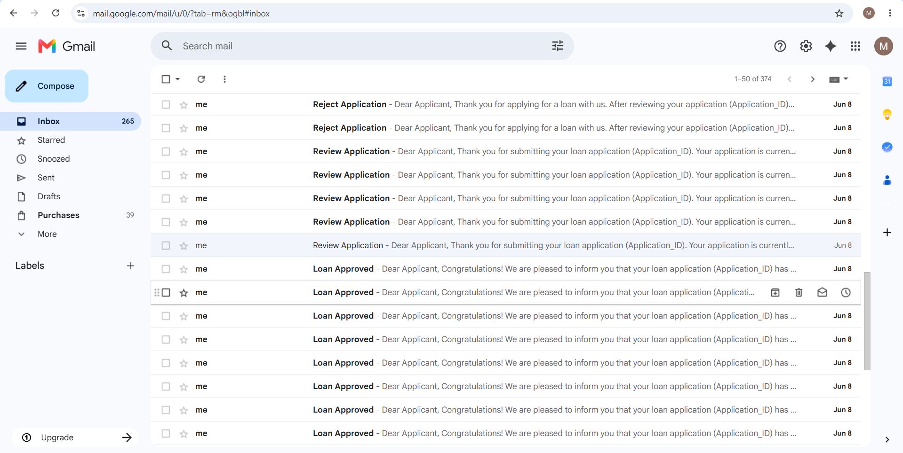
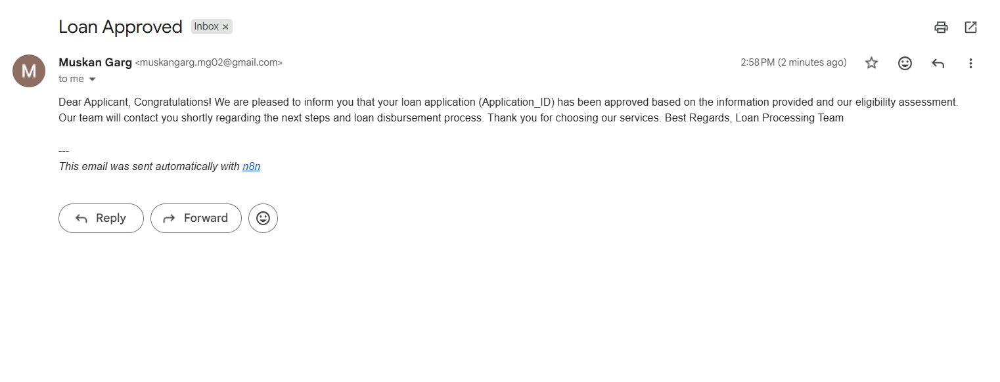
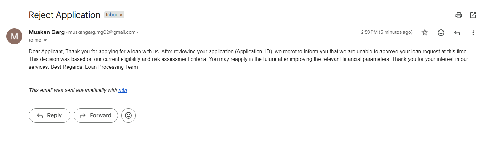
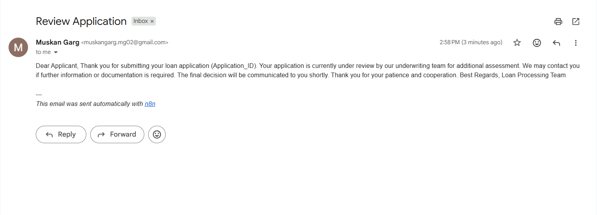
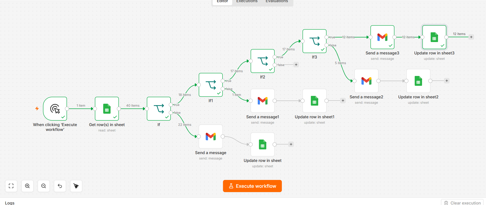

# 🏦 AI-Powered Loan Approval Automation using n8n

<p align="center">
  Intelligent Loan Processing • Credit Risk Assessment • AML Screening • Workflow Automation
</p>

---

# 📌 Project Overview

This project automates the loan approval process using **n8n**, **Google Sheets**, **Gmail**, and rule-based decision logic.

The workflow evaluates loan applications based on applicant financial data, credit score, debt-to-income ratio (DTI), and AML/PEP watchlist screening. Based on predefined business rules, applications are automatically approved, rejected, or routed for manual compliance review.

This project demonstrates how financial institutions can leverage workflow automation to improve efficiency, reduce operational costs, and strengthen compliance monitoring.

---

# 🎯 Objectives

* Automate loan approval decisions
* Reduce manual processing time
* Improve decision accuracy
* Implement AML & PEP screening
* Enhance compliance coverage
* Demonstrate AI-driven financial automation

---

# 🏗️ Solution Architecture

```text
Google Sheets Dataset
          ↓
     n8n Workflow
          ↓
    Data Validation
          ↓
 Credit & DTI Evaluation
          ↓
 AML / PEP Screening
          ↓
 Decision Engine
          ↓
 ┌─────────────┬─────────────┬─────────────┐
 │             │             │
Approve     Reject     Manual Review
 │             │             │
 └────── Email Notifications ──────┘
```

---

# ⚙️ Workflow Process

### Step 1 — Read Loan Dataset

Import applicant records from Google Sheets.

### Step 2 — Evaluate Financial Criteria

Analyze:

* Credit Score
* Debt-to-Income Ratio (DTI)
* Income Eligibility

### Step 3 — AML & PEP Screening

Perform watchlist checks to identify:

* AML Risks
* PEP Matches
* Compliance Concerns

### Step 4 — Decision Routing

Applications are classified into:

* Auto-Approve
* Auto-Reject
* Manual Review

### Step 5 — Update Records

Store:

* Approval Status
* Decision Basis
* Risk Indicators

### Step 6 — Send Notifications

Automatically notify:

* Applicants
* Compliance Team
* Underwriting Team

---

# 🧠 Loan Approval Rules

| Rule               | Condition                                        |
| ------------------ | ------------------------------------------------ |
| Credit Score Check | Credit Score ≥ 600                               |
| DTI Check          | DTI ≤ 0.50                                       |
| Approval Rule      | Credit ≥ 600 AND DTI ≤ 0.50 AND Watchlist < 0.30 |
| Rejection Rule     | Credit < 560 OR DTI > 0.55                       |
| Manual Review Rule | Watchlist ≥ 0.30 AND < 0.80                      |
| AML Escalation     | Watchlist ≥ 0.80                                 |
| PEP Match Rule     | Immediate Compliance Review                      |

---

# 📊 Decision Classification

| Status        | Description                             |
| ------------- | --------------------------------------- |
| Auto-Approve  | Meets all financial criteria            |
| Auto-Reject   | High financial or compliance risk       |
| Manual Review | Borderline or compliance-sensitive case |

---

# 📈 Dataset Summary

| Metric              | Value |
| ------------------- | ----- |
| Total Applications  | 40    |
| Auto Approved       | 18    |
| Auto Rejected       | 11    |
| Manual Review       | 11    |
| Gmail Notifications | 4     |
| Dataset Fields      | 10    |

---

# 📸 Project Screenshots

## Loan Approval Dataset


```

Shows:

* Applicant Information
* Credit Scores
* DTI Ratios
* Watchlist Results
* System Decisions

---
## 📧 Automated Loan Decision Notifications



This screenshot shows the automated email notifications generated by the n8n workflow, including:
- ✅ Loan Approved emails
- ❌ Loan Rejected emails
- 🔍 Review Application emails
- Real-time applicant communication through Gmail integration

## Auto Approval Email


```

Automated approval notification sent to eligible applicants.

---

## Loan Rejection Email


```

Automated rejection notification generated for high-risk applicants.

---

## Compliance Review Email


```

Compliance team notification for AML/PEP review cases.

---

## n8n Workflow Architecture


```

Workflow showing:

* Data Extraction
* Conditional Logic
* AML Screening
* Decision Routing
* Email Notifications

---

# 📊 Business Impact

| Parameter            | Manual Process     | Automated Process |
| -------------------- | ------------------ | ----------------- |
| Processing Time      | 3–5 Days           | < 2 Minutes       |
| Human Effort         | 100% Manual        | 73% Automated     |
| Error Rate           | 35%                | < 3%              |
| Cost Per Application | $2,400             | $180              |
| Daily Throughput     | 20–30 Applications | 500+ Applications |
| Compliance Coverage  | 60%                | 100%              |

### Key Improvements

* ⚡ 99.9% Faster Processing
* 💰 92% Cost Reduction
* 📈 17x Throughput Increase
* 🎯 91% Error Reduction

---

# 🛠️ Tech Stack

| Technology           | Purpose             |
| -------------------- | ------------------- |
| n8n                  | Workflow Automation |
| Google Sheets        | Dataset Storage     |
| Gmail                | Email Notifications |
| JavaScript           | Business Logic      |
| AML Screening Rules  | Compliance Checks   |
| Credit Risk Analysis | Decision Making     |

---

# 📂 Repository Structure

```text
loan-approval-automation/
│
├── README.md
├── Loan Approval Workflow.json
├── Loan Approval Dataset.xlsx
├── loan-dataset.png
├── approval-email.png
├── rejection-email.png
├── compliance-review-email.png
└── n8n-workflow.png
```

---

# 🚀 Run Locally

### Clone Repository

```bash
git clone https://github.com/your-username/loan-approval-automation.git
```

### Open Project

```text
Open n8n
↓
Import Workflow JSON
↓
Connect Google Sheets Credentials
↓
Connect Gmail Credentials
↓
Execute Workflow
```

---

# 🔮 Future Scope

* Machine Learning Credit Scoring
* Predictive Risk Assessment
* WhatsApp Notifications
* Salesforce CRM Integration
* Real-Time Loan Dashboard
* Multi-Currency Loan Processing
* LLM-Based Risk Evaluation

---

# 🎓 Learning Outcomes

* n8n Workflow Design
* Financial Process Automation
* AML & Compliance Monitoring
* Credit Risk Assessment
* Business Process Mapping
* Workflow Decision Routing
* FinTech Automation Concepts

---

# 👨‍💻 Developed By

## Group 4 – MBA Applied Finance

**Members:**

* Muskan Garg
* Bhumi Gupta
* Manu Bansal
* Vivek
* Sandeep
* Samridhi
* Vansh

**Course:** MBA Applied Finance
**Subject:** Financial Technology & Automation

**Faculty:** Prof. Lavanya Srivastava

---

### ⭐ If you found this project useful, consider giving it a star.

### Screenshot file names to use in GitHub

Rename your screenshot files exactly like this:

```text
loan-dataset.png
approval-email.png
rejection-email.png
compliance-review-email.png
n8n-workflow.png
```

Place all images in the **root folder** of the repository (same level as README.md). This will ensure GitHub displays them correctly.
